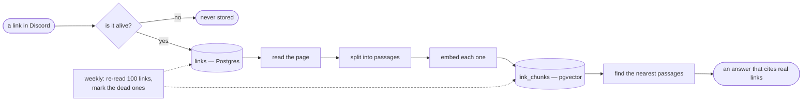

# souravinsights.com

My little corner of the internet. I'm a product engineer — I write about design and
engineering, keep a collection of links worth keeping, and this is the code behind
all of it.

It's a personal site, so it's a workshop: some of it is polished, and some of it is
experiments I haven't thrown away yet.

## The part worth reading

Most of this is an ordinary Next.js site. The part I'd actually show someone is the
curated links collection, because it fixes two problems I kept running into.

**The collection was quietly losing links.** It started as a Discord channel, and
Discord serves only the newest 100 messages per channel — so every new link pushed
an old one off the page. The links live in Postgres now; Discord is only how they get
added, and the page, the feed, the sitemap and the API all read the database.

**The real problem was that it stored pointers.** A URL and a one-line description —
which meant I could only find a link if I remembered its title. “The article about why
nested rounded corners look wrong” found nothing. It's called *Corners are relative*.
So every page is now read, split into passages and embedded, and search matches what a
page *says*. 491 links, about 2,800 passages, which is how the agent answers “what
have I saved about shipping versus building” and cites a real essay.

Four ways in:

| | |
| :--- | :--- |
| **Ask** | a question on the Insights page, answered with citations the model can't invent |
| **Writing Desk** | a draft paragraph → the passages that back it, each with one line on why |
| **Compare** | a comparison that reads a page fresh when the stored text isn't enough |
| **MCP** | the same search, inside Cursor or Claude |



None of that is clever. It's one extraction step, one embedding step, and a search
that ranks links instead of passages. The work was in the failure modes — six of them
are written up in [`docs/kb/05-failure-modes.md`](docs/kb/05-failure-modes.md).

## Running it

Node 22.12 or newer, and a Postgres with the `pgvector` extension (this one uses
Neon).

```bash
git clone https://github.com/SouravInsights/souravinsights.com.git
cd souravinsights.com
yarn install

cp .env.example .env.local     # then fill in what you need
npx drizzle-kit migrate        # creates the tables

yarn dev
```

The site runs on `DATABASE_URL` alone. Only the agent and search need
`OPENROUTER_API_KEY`, and only the links intake needs the Discord credentials. The
rest of the stack is Next.js App Router, Tailwind, Drizzle over Neon, and Trigger.dev
for the two weekly jobs.

## The knowledge base

```bash
npx tsx scripts/kb-extract.ts                        # pending links → passages → vectors
npx tsx scripts/kb-extract.ts --status failed,thin   # re-read the rows that came back weak
npx tsx scripts/kb-eval.ts                           # the scoreboard: extraction + retrieval
npx tsx scripts/kb-report.ts --write                 # refresh docs/kb/build-report.md
npx tsx scripts/kb-mcp.ts                            # the MCP server, on stdio
```

## Where to read more

- **[`docs/kb/`](docs/kb/README.md)** — how all of this works, from zero, with the
  reasoning. Start here.
- **[`docs/spec/`](docs/spec)** — what was built, and a section naming every place
  the build disagreed with the plan.
- **[`docs/review/`](docs/review)** — the critique of the original spec, and why the
  extractor isn't a hosted service.
- **`/docs` on the live site** — how to query the collection from code or an agent.

## License

There's no license file here, so it's all rights reserved — the writing and the
collection are mine. Ask if you want to use something.
