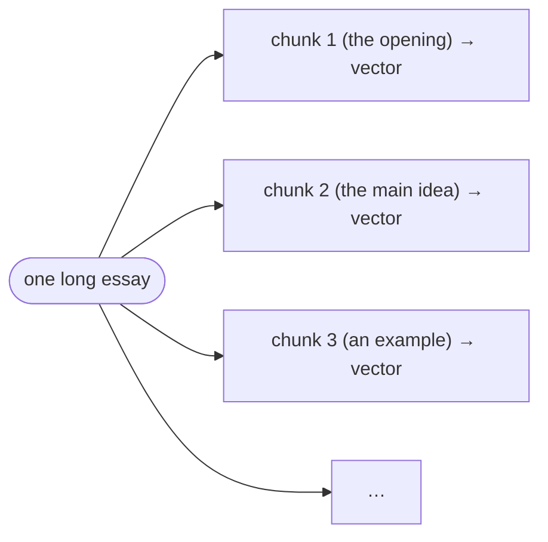
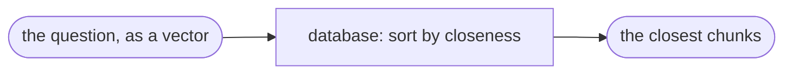
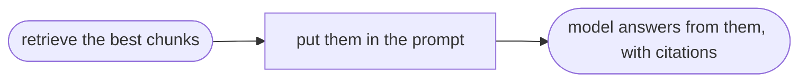
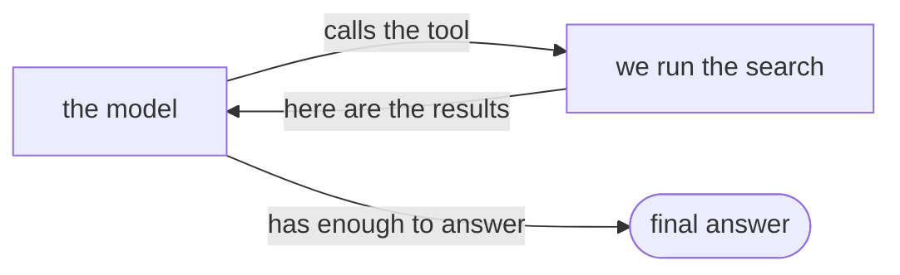

# 01 — The six ideas, from zero

Everything in this system is these six ideas, combined. No background assumed.

## 1. Embedding — text as a list of numbers

An embedding model takes a piece of text and returns a fixed list of numbers. That list is
called a **vector**. Ours has 1,536 numbers.

The property we use: text with similar meaning produces similar vectors, even when the words
are different.

```
"nested rounded rectangles look wrong"   →  [0.11, -0.42, 0.03, …]
"corners are relative"                   →  [0.09, -0.38, 0.07, …]   ← close
"best pizza in Rome"                     →  [-0.50, 0.21, …]         ← far
```

The first two share almost no words, yet sit close together. That is what lets us search by
meaning instead of by keyword.

How "close" is defined: the angle between two vectors. Same direction = similar meaning.
The standard measure is **cosine similarity** (1 = identical, 0 = unrelated).

> Cost: ~$0.02 per million words. The whole collection is a few cents, paid once.

## 2. Chunk — one passage per vector

A 4,000-word essay reduced to a single vector is a blur of everything and a clear statement
of nothing. So long text is split into passages of roughly 500 words — **chunks** — and each
is embedded separately.



Two rules:
- **Split on paragraph boundaries.** A chunk that mixes a headline with half a sentence
  embeds poorly.
- **Overlap adjacent chunks ~15%.** A sentence that lands on a boundary should still appear
  whole in one of the chunks.

The chunk is also the unit we cite, so a citation can point at a specific passage.

## 3. Vector search — nearest neighbours

Every chunk's vector is stored in Postgres (the extension for vectors is `pgvector`). To
search, we embed the question and ask the database for the chunks whose vectors are closest
to it.



An index (called **HNSW**) keeps this fast as the collection grows.

## 4. RAG — retrieve, then generate

The model was never trained on your links, so it cannot recall them. Instead we retrieve the
most relevant chunks, put them into the prompt, and ask the model to answer using only those.
(This is the standard "open-book exam" setup: the facts are in front of it, not in memory.)



Because the facts are in the prompt, the model has far less room to invent them.

## 5. Tool calling — the model can request data

We give the model a function it is allowed to call:

```
search_knowledge(question)  →  we run the search  →  we return the chunks
```

When it needs evidence, it calls the function; we run it; the model continues with the result
in view. This is what makes it an *agent* rather than a single prompt-response.

## 6. Agent — a loop



The loop repeats until the model decides it can answer. Ours allows 1–2 searches per question:
enough to try a better search, few enough to stay cheap.

---

## Where each idea lives in our tables

| Idea | Stored where |
| :--- | :--- |
| A link (a URL) | `links` |
| A passage + its vector | `link_chunks` |
| Your question | nowhere — embedded on the fly |

## The two dials

Everything you can tune comes down to two choices, both named in one file (`model.ts`):

1. **The embedding model** — decides how text becomes vectors.
2. **The chat model** — the model that writes answers. It must support tool calling (idea 5).

Change either and you redo the matching step. Keeping both in one file is why the rest of the
code never needs to know which model is running.
