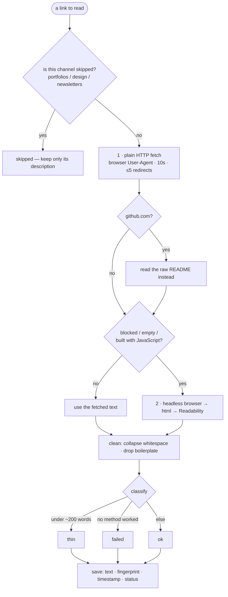

# 02 — Extraction: turning a URL into searchable text

This decides whether the whole system works. A weak extractor means a weak knowledge base, no
matter how good the embeddings or the model are. The spec gives this one line; this page is the
detail.

## The core idea: a fallback ladder

We never rely on a single method. Try the cheapest approach first; escalate only when it
definitively fails; never let one bad page stop the run.

## Why each step exists

**1. Plain HTTP fetch.** Most articles are already server-rendered HTML, so a normal request
returns everything. We send a real browser User-Agent, because services like Cloudflare block
requests that look automated. (The repo already hit this in `src/lib/links/health.ts`.)

**2. Readability.** `@mozilla/readability` strips navigation, ads, and footers and returns the
article body. It works on a real DOM (a full document object), so we pair it with **jsdom**, the complete
DOM implementation — its extra weight is irrelevant in an offline pipeline. It does **not** work
with `node-html-parser`, which is a faster, lower-level parser with a different interface. That
is why the spec's original listed stack didn't work as written.

**3. Headless browser — only when needed.** Some pages build their content with JavaScript, so
the plain fetch returns 200 with an empty body. For those, we run a headless Chromium, wait for
the page to settle, then run Readability on the rendered HTML. Reuse the timing logic in
`src/lib/screenshot.ts`. Always close the browser and cap the wait; if it hangs, fall back to
whatever the plain fetch returned.

**GitHub is a special case.** Most `tools` links are GitHub repos; the page is chrome and the
content is the README. For `github.com/owner/repo`, fetch
`raw.githubusercontent.com/owner/repo/HEAD/README.md`, then strip Markdown.

## How deep to go, per channel (defined, not a crawl)

| Channel | What to read | Extra fetch? |
| :--- | :--- | :--- |
| reading-list (Articles) | the full article | no |
| resources | the landing page + its table of contents | no (don't crawl the lessons) |
| tools | the homepage (or the README for GitHub) | GitHub README only |
| product-hunt (Products) | the homepage | one same-domain `/pricing` page, if linked |
| newsletters / fav-portfolios / design-inspo | nothing | marked `skipped` (description only) |

This resolves the spec's contradiction between "no second-hop links" and "also fetch /pricing":
the only second fetch allowed is same-domain, a single page, from an allowlist.

## Cleanup and classification

After extraction, collapse whitespace and drop obvious boilerplate ("Subscribe", cookie
banners). Then label the result:

- **`thin`** — cleaned text is under ~200 words (a paywall, an unrendered JS page, a stub).
- **`failed`** — no method produced any text.
- **`ok`** — everything else.

`thin` and `failed` are separate on purpose: `failed` may be worth retrying (a site can
recover), `thin` usually is not (a paywall won't lift).

## Re-running safely

- We store a `content_hash` — a fingerprint of the extracted text. If a page hasn't changed,
  the re-run skips it: no refetch, no re-embed.
- Re-chunking overwrites chunks by position (`unique(link_id, chunk_index)`), so nothing
  duplicates. But if a page got *shorter*, its old tail chunks would linger — so after
  re-chunking, delete chunks whose `chunk_index` is past the new count.

## What "good" looks like

- The `Untitled` links get real titles (we now have the page's `<title>`).
- Most links end `ok`, the browser fallback is rarely needed, and most `thin` results are
  paywalls.
- `04-evals.md` proves this with saved test pages, rather than by eyeballing 500 links.

## Operational rules

- **Concurrency:** about 6 at a time, and only one request at a time to any single host.
- **Timeouts** on the fetch, the render, and the whole per-page step.
- **Log a per-run summary** (`ok/thin/failed/skipped` counts, and how often the fallback was
  needed), the way the health sweep already does.
