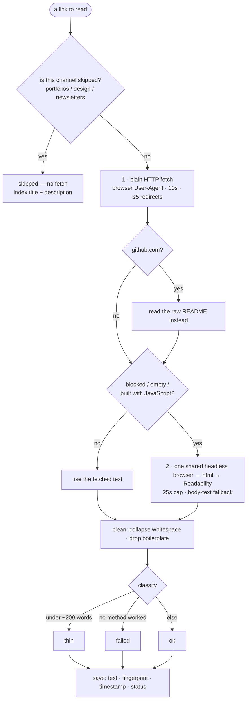

# 02 — Extraction: turning a URL into searchable text

This decides whether the whole system works. A weak extractor means a weak knowledge base, no
matter how good the embeddings or the model are. The spec gives this one line; this page is the
detail.

## The core idea: a fallback ladder

We never rely on a single method. Try the cheapest approach first; escalate only when it
definitively fails; never let one bad page stop the run.



## Why each step exists

**1. Plain HTTP fetch.** Most articles are already server-rendered HTML, so a normal request
returns everything. We send a real browser User-Agent, because services like Cloudflare block
requests that look automated. (The repo already hit this in `src/lib/links/health.ts`.)

**2. Readability.** `@mozilla/readability` strips navigation, ads, and footers and returns the
article body. It works on a real DOM (a full document object), so we pair it with **jsdom**, the complete
DOM implementation — its extra weight is irrelevant in an offline pipeline. It does **not** work
with `node-html-parser`, which is a faster, lower-level parser with a different interface. That
is why the spec's original listed stack didn't work as written.

**3. Headless browser — only when needed.** Some pages build their content with JavaScript, so
the plain fetch returns 200 with an empty body. For those we run a headless Chromium, wait for
the page to settle (`document.fonts.ready`, then one second), and run Readability on the
rendered HTML. Three things about this rung were learned by breaking it in the bulk run, and all
three live in `src/lib/kb/render.ts`:

- **One browser per *run*, not per page.** Launching a fresh Chromium per page is what produced
  a pile of false `failed` rows: under concurrency most JS pages came back empty, though they
  render fine one at a time. The browser is now created lazily once and reused; pages are opened
  and closed against it.
- **A hard 25s cap per page.** Navigation had its own timeout, but `document.fonts.ready` and
  `page.content()` can hang forever on a broken page — and one such URL stalled an entire run.
  The cap bounds the damage to a single link; on timeout the page is closed, which aborts the
  work still running.
- **Fall back to the page's visible body text.** Readability aggressively discards text on
  app-style pages. If it returns under 50 words while the rendered body has more, we keep
  `document.body.innerText` instead — a noisy passage beats a `failed` row.

If the render still yields nothing, we keep whatever rung 1 returned, so a link never regresses
to `failed` just because the browser had a bad day.

**GitHub is a special case.** Most `tools` links are GitHub repos; the page is chrome and the
content is the README. For `github.com/owner/repo`, fetch
`raw.githubusercontent.com/owner/repo/HEAD/README.md`, then strip Markdown.

## How deep to go, per channel (defined, not a crawl)

| Channel | What to read | Extra fetch? |
| :--- | :--- | :--- |
| reading-list (Articles) | the full article | no |
| resources | the landing page + its table of contents | no (don't crawl the lessons) |
| tools | the homepage (or the README for GitHub) | GitHub README only |
| product-hunt (Products) | the homepage | one same-domain `/pricing` page, if linked |
| newsletters / fav-portfolios / design-inspo | nothing | marked `skipped`: no page fetch, but the title + description is indexed as one passage |

This resolves the spec's contradiction between "no second-hop links" and "also fetch /pricing":
the only second fetch allowed is same-domain, a single page, from an allowlist.

## Cleanup and classification

After extraction, collapse whitespace and drop obvious boilerplate ("Subscribe", cookie
banners). Then label the result:

- **`thin`** — cleaned text is under ~200 words (a paywall, an unrendered JS page, a stub).
- **`failed`** — no method produced any text.
- **`ok`** — everything else.

`thin` and `failed` are separate on purpose: `failed` may be worth retrying (a site can
recover), `thin` usually is not (a paywall won't lift).

## Re-running safely

- **The queue is the status column.** `kb-extract` only touches rows whose `extract_status` is in
  its filter — `pending` by default. So a crash mid-run just means "run it again": the links
  already read are no longer pending.
- **`--status failed` (or `failed,thin`) re-reads the rows that came back weak.** This flag is
  what made a better extractor *worth* having. Without it, every row the old code got wrong would
  stay wrong forever, because it was never pending again.
- **A link's passages are replaced wholesale** — delete by `link_id`, then insert the new ones.
  Re-reading a page can therefore never leave the tail of a longer previous version behind. (The
  earlier plan was to delete chunks past the new count; deleting all of them is simpler and has
  the same effect.)
- `raw_text` and `content_hash` are stored per link. The bulk script never compares the hash — it
  is driven by status — but the weekly re-read below does, and that is what makes the re-read
  cheap.

## Keeping it fresh — the weekly re-read

`src/trigger/kb-refresh.ts` runs every Monday, an hour after the health sweep, so pages that died
overnight are already marked `dead` and never re-read:

```
Monday 09:00  links-health-check   → marks the newly dead rows
Monday 10:00  kb-refresh           → re-reads 100 links, re-embeds only the changed ones
```

Three decisions worth naming, because each is a trap:

**It rotates instead of filtering by date.** Ordering by `extracted_at` ascending — least recently
read first — and capping the run at 100 means every link is re-read roughly monthly and none is
frozen forever. The obvious alternative, "only links added in the last 90 days", was measured and
dropped: it covered 79 of 500 links, so 84% of the collection would never have been re-read at all.

**It re-fetches every page but re-embeds only changed ones.** We can't know a page changed without
asking it, so the fetch always happens. The embedding call is what costs money, and that is exactly
what `onlyIfChanged` skips — which is why the weekly job is nearly free.

**It skips the never-fetched channels.** A `skipped` channel's text comes from the database row,
not from a page, so nothing about it can go stale.

The re-read runs through the same `ingestLink()` as the first read (`src/lib/kb/ingest.ts`), which
is the point of that module existing: a refresh that chunked or embedded differently from the first
read would quietly change the collection's quality, and the eval numbers would move with nobody
knowing why.

## What "good" looks like — the actual numbers

The first full build, 500 links (`docs/kb/build-report.md`, regenerable):

| Status | Count | Meaning |
| :--- | ---: | :--- |
| `ok` | 255 | readable text, chunked and embedded |
| `thin` | 89 | under 200 words — a landing page, a paywall, a JS shell |
| `skipped` | 138 | never fetched; title + description indexed as one passage |
| `failed` | 9 | no method produced any text |
| `pending` | 9 | not read yet |

**2,794 passages** in total. `Untitled` links got real titles from the page's `<title>`.

The number that matters is *how much of the collection search can reach at all* — and it is not
`ok + thin`. It is `ok + skipped` (255 + 138), plus the partial text from `thin`. The report's
per-channel `missing` column is the honest bottom line: 14 links stored no passage whatsoever, so
for those the agent can only answer from the title and description.

The bulk run's real lesson: the `failed` count was mostly *our* bug, not the internet's. JS pages
that rendered fine one at a time were coming back empty under concurrency, and Readability was
throwing away text on app-style pages. Both fixes are above.

`04-evals.md` is where this stops being eyeballing — but note its extraction check is still
unbuilt, so today **the report is the measurement**.

## Operational rules

- **Concurrency:** 4 at a time (`CONCURRENCY` in `scripts/kb-extract.ts`), all sharing the one
  browser.
- **A timeout at every rung:** 10s on the plain fetch, 25s on the render. Each link's work is
  caught on failure, so one bad page can't stop the run.
- **A per-run tally** (`ok / thin / failed / skipped`, plus the passage count) prints every 10
  links — the same shape as the health sweep's summary.
- **jsdom is heavy, and only the scripts pay for it.** Nothing in a Next route imports the
  extractor, so its weight never reaches a request. `next.config.mjs` externalizes
  `@sparticuz/chromium` and `puppeteer-core` for the routes that *do* render (`/api/link-preview`).
