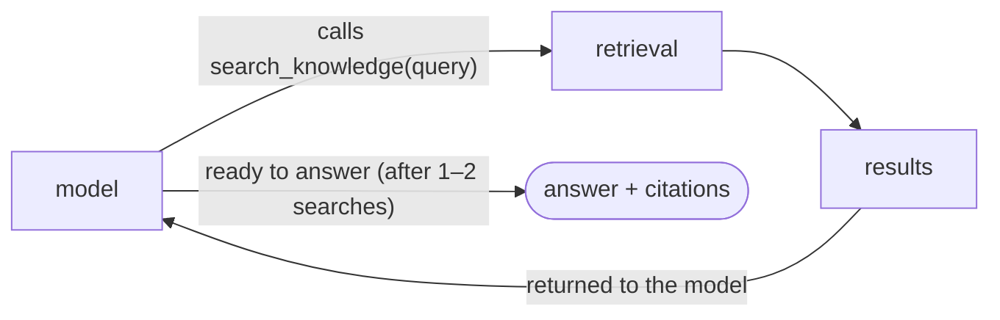

# 03 — Retrieval and the agent

How a question becomes an answer. Two parts: **retrieval** (find the right passages) and the
**agent loop** (write the answer from them).

## Retrieval: question → passages


In words:

1. Embed the question → a vector.
2. Ask Postgres for the chunks whose vectors are closest.

The query looks like this:

```sql
SELECT c.content, c.chunk_index, l.url, l.title, l.channel
FROM link_chunks c
JOIN links l ON l.id = c.link_id
WHERE l.hidden_at IS NULL AND l.health <> 'dead'   -- never surface hidden/dead links
ORDER BY c.embedding <=> :queryVector              -- cosine distance
LIMIT 40;
```

Two details the spec leaves out, and they matter:

**Group by link before ranking.** The 40 closest chunks might all belong to one article. Left
as-is, one page would fill the entire result. So we group chunks by their link, keep the best
2–3 per link, and rank the links.

**Rank by similarity alone.** The collection gets too few likes to rank on, so we don't use them
at all — the nearest link wins. (The page's existing "Most liked" sort is a browsing choice, not
a retrieval signal. The two are separate.)

## The agent loop: passages → answer



There is one tool, `search_knowledge(query, channel?)`. The model may call it again with a
better query. We cap the loop (`stopWhen`, e.g. ≤ 4 steps), so a question costs about $0.001.

### The tool's return value (this is the safeguard)

```jsonc
{
  "matches": [
    { "chunk": "…passage…", "url": "…", "title": "…", "channel": "tools", "chunk_index": 3 }
  ]
}
```

The UI builds citation cards **from this data** — never by scanning the model's text for URLs.
The effect: the model cannot show a link we did not return. A made-up URL has nowhere to
appear, so "don't invent links" becomes a property of the design rather than a request in the
prompt.

## The three experiences built on top

| Experience | Input → output | Solves |
| :--- | :--- | :--- |
| **Ask** | question → grounded answer with citation cards | "best tool for X", "what did I save about Y" |
| **Writing Desk** | a thesis or a draft paragraph → 6–10 relevant passages, each with a one-line "why relevant" | the blank-page / 15-tabs problem |
| **Compare** | candidates → a small table with a recommendation; may fetch a page fresh | "compare these sandboxes" |

`fetch_link` is the only place the agent reaches the open web during a question. It fetches a
URL that a user supplies, so it must:
- allow only http(s) and block private/internal addresses (SSRF guard),
- cap the response size and the number of redirects,
- cache results for 24 hours,
- run at most 3 times per question.

## When it can't answer

- No relevant chunks → "the collection doesn't cover this", plus the nearest category. Never a
  made-up answer.
- Database down → a plain message; the page itself is unaffected (the agent is an add-on, never
  in the page's render path).
- Retrieved text is untrusted, so we wrap it in clear delimiters. Text like "ignore previous
  instructions" is then treated as content, not as an instruction.
