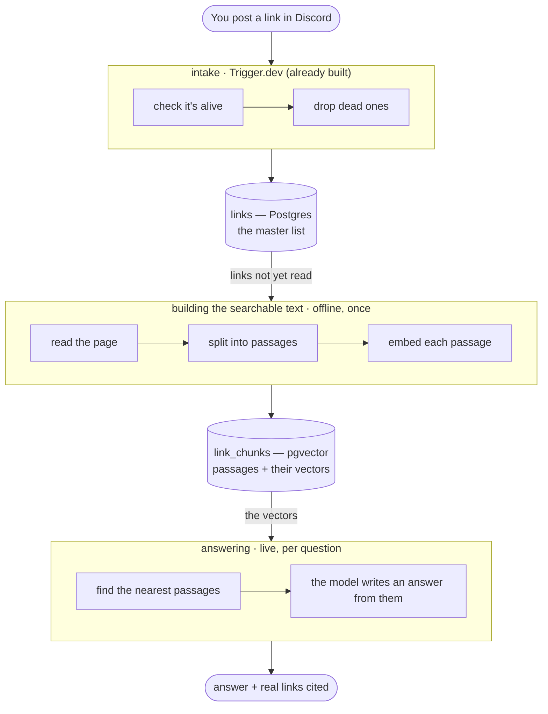

# The Insights Knowledge Base — how it works

A plain-language walkthrough of the agent + RAG pipeline behind `souravinsights.com/curated-links`.
No prior background assumed.

**In one line:** we convert each saved link into numbers that represent its meaning, then
answer questions by finding the closest numbers — instead of matching keywords.

## Where the build actually is

| Piece | State |
| :--- | :--- |
| Link registry + health | built (its own earlier spec) |
| Extraction | built — 500 links: 255 `ok`, 89 `thin`, 138 `skipped`, 9 `failed`; 2,794 passages |
| Chunk + embed + search | built |
| Retrieval eval | built — `recall@5` / `MRR@10` against a keyword baseline |
| **Ask** agent + panel | built, live on the page |
| **Writing Desk** | retrieval core + admin-only endpoint built; the *editor* is a separate spec |
| Compare | not started |
| Weekly re-read (`kb-refresh`) | built — rotating, 100 links per run |
| Public search API (`/api/v1/search`) | not started |
| PostHog signals | not wired |

These docs describe what exists, and label what doesn't. Where a page teaches something unbuilt, it
says so — a doc that reads as if everything already ran is worse than no doc at all.

## The commands

```
npx tsx scripts/snapshot-links.ts                     # Discord → link registry
npx tsx scripts/kb-extract.ts                         # pending links → text → chunks → vectors
npx tsx scripts/kb-extract.ts --status failed,thin    # re-read the rows that came back weak
npx tsx scripts/kb-report.ts --write                  # regenerate build-report.md
npx tsx scripts/kb-eval.ts                            # the retrieval scoreboard
npx tsx scripts/kb-suggestions.ts                     # regenerate the suggestion chips
npx trigger.dev@latest dev                            # run the weekly tasks locally

# Writing Desk — the saved links that back what you're writing (admin only)
curl -s localhost:3000/api/insights/desk \
  -H "Authorization: Bearer $ADMIN_SECRET" -H 'content-type: application/json' \
  -d '{"draft":"Nested rounded corners look wrong because the outer radius must equal the inner plus the padding."}'
```

## Read in order

| Page | What it covers |
| :--- | :--- |
| [`01-concepts.md`](./01-concepts.md) | The six ideas, from zero (embedding, chunk, vector search, RAG, tool calling, agent) |
| [`02-extraction.md`](./02-extraction.md) | How a link becomes searchable text — the part that decides quality |
| [`03-retrieval-and-agent.md`](./03-retrieval-and-agent.md) | How a question finds the right passages and gets answered |
| [`04-evals.md`](./04-evals.md) | How we prove it works — the numbers |
| [`05-failure-modes.md`](./05-failure-modes.md) | What can go wrong, and the fix |

The formal spec is at [`../spec/insights-agent.md`](../spec/insights-agent.md); the critique
at [`../review/insights-agent-review.md`](../review/insights-agent-review.md). The current
state of the build is snapshotted in [`build-report.md`](./build-report.md) — link counts and
the thin/failed list (`npx tsx scripts/kb-report.ts --write` to refresh it).

## The whole system in one picture



## Why there are three stages

Each stage is a separate job, run at a separate time.

| Stage | When it runs | Cost | Why separate |
| :--- | :--- | :--- | :--- |
| Intake | when you post a link | ~free | only adds to a list (already built) |
| Build | once, then when a page changes | cents | slow, can fail per page, must be rerunnable |
| Ask | per question | ~$0.001 | must be fast, cheap, and must never break the page |

## Why the split matters

Adding a link is a different job from reading it, and reading it is different from answering
a question. Keeping them apart is what lets a single bad page fail on its own, keeps a
question fast, and lets the whole searchable store be rebuilt any time without touching the
page people are browsing.
