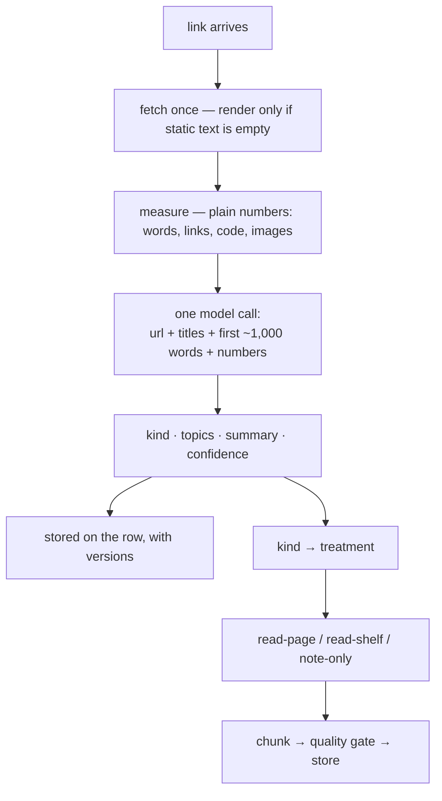

# Classification — Spec

**Status:** direction agreed, kind list **provisional** — frozen after the describe pass below.

The pipeline's missing stage. Today nothing asks *what kind of page is this* — it asks which
Discord channel the link was dropped in, and treats that as the same question. It is not.
Classification sits **after fetch, before extraction**.

---

## Measured facts (2026-10, 490 visible links)

Every decision below hangs on these, not on intuition:

- **3 github.com links, 0 youtube, 1 substack, 0 PDFs.** No repo/doc/video-specific kinds are
  justified. A kind list copied from a generic web taxonomy would mis-describe this collection.
- **343 of 490 links are root URLs.** URL shape alone says nothing about a page.
- **Channel and page kind disagree in both directions.** `resend.com/blog/…` (an article) sits
  in `product-hunt`; `justinjackson.ca/articles` (a blog) sits in `reading-list`; `resources`
  holds a book, a tutorial site, a directory and a gallery side by side. The channel is a note
  from years ago, not a property of the page.
- **Shape lies; meaning doesn't.** A citation-heavy essay (`anthonyhobday.com` — *"Notes on
  software quality"*: 73 links, ~69 outbound to the sources it quotes) looks like "a page of
  links" to any counting rule. A reader calls it an essay with sources. Verified against the
  saved fixture.

## The rule

**Meaning assigns labels; numbers never do.** One model call per link is the classifier —
there is no mechanical classification stage. Page measurements (word count, link counts, code
share, image count) are *evidence shown to the model*, and later inputs to the quality gate —
never verdicts on their own.

Why model-first and not rules-first: 490 links × one call each costs under a dollar, once —
there is no cost argument for a rule tier, and the rule tier is precisely where wrong answers
come from. The collection is a long tail of near-unique hosts; rules would cover none of it.

## The three questions

For every link, the classifier answers:

1. **What is it?** → `kind` — one label from the list below.
2. **What is it about?** → `topics` — 3–7 free-form keywords (design, motion, agents, pricing…).
3. **How much of it do we keep?** → the treatment, implied by kind: **read**, **listed** or
   **noted**. Overridable per link.

## Kind list (provisional)

Naming rule: plain words, and each label passes the friend test — *"what did you save?"* — the
label is what you'd answer. A kind earns its place only if its treatment or its filtering value
differs from every other kind. `other` always exists.

| Kind | What it is | Examples | Treatment |
| :--- | :--- | :--- | :--- |
| **article** | one long-form piece of writing | andrewconner.com/the-option-method | read |
| **blog** | an ongoing place of writing — solo or magazine | justinjackson.ca/articles, thecreativeindependent.com | listed |
| **tool** | a thing you use — app, SaaS, library, CLI | boat.dev, cursor.com | read |
| **learning** | a course, book, or tutorial site | learn-inference.com, patterns.dev | read |
| **gallery** | a site to look at for inspiration | navbar.gallery, 60fps.design | listed |
| **directory** | a list whose value is pointing elsewhere | blogroll.org | listed |
| **portfolio** | a person or studio's own site | adam.new | noted |
| **newsletter** | a subscription | — | noted |
| **other** | fallback, doubles as the review queue | — | read |

Settled calls, recorded so they aren't relitigated:

- **No catalogue/gallery split.** Both are inspiration shelves — one kind, **gallery**. The
  difference between 60fps.design/storyboards (items that *say* something) and navbar.gallery
  (items that *show* something) is a storage question, handled by the listed treatment — not a
  category.
- **Directory is its own kind** because its items are signposts to sites not in the collection;
  storing them means storing tables of contents for books we don't own.
- **No repo kind** (3 links), no docs kind (a rounding error), no media kind (0 links).
- Labels rejected for readability: `index`, `person`, `landing`, `catalogue`.

## The three treatments (replaces today's extractor shape)

Treatment is the only thing the pipeline consumes. Three readers, one per treatment — no
per-kind extractor zoo:

| Treatment | Kept | Reader | Kinds |
| :--- | :--- | :--- | :--- |
| **read** | full text → clean → passages | `read-page` (today's ladder, fixed) | article, tool, learning, other |
| **listed** | what the place *is* + items that state something | `read-shelf` | blog, gallery, directory |
| **noted** | title + description as one passage; never fetched | `note-only` | portfolio, newsletter |

The state-or-point rule lives **inside `read-shelf`**, not in classification: an item that
states something earns a passage; a signpost or an image does not. **No crawling, ever** — the
registry spec's line stands: one page, no second hop beyond the named exceptions.

## The model call

- **Input:** url, intake title + description, the page's own `<title>`/og description, the
  first ~1,000 words of cleaned text (rendered text when the static fetch is empty), and the
  measured numbers. Never metadata alone — metadata is only what the publisher claims.
- **Output:** `{ kind, topics[3–7], summary, confidence }` — a fixed, validated shape. The
  `summary` (one line, in the model's own words) is the audit trail for the label and is
  embeddable itself.
- **Low confidence → `other`.** The model may always say "I don't know"; that is the review
  queue, and it keeps the kind list honest.
- Model pinned in `src/lib/kb/model.ts`, same boundary as the rest of the KB.

## Trust

- **Golden file:** `eval/kb-classifier-golden.json` — ~50 links hand-labeled by the owner. The
  classifier is "right" only when it agrees with that file; re-run on any prompt change.
- **Overrides:** a small data file of per-URL fixes that always wins.
- **Stored per row:** `kind`, `topics`, `summary`, `signals` (jsonb), `classifier_version`,
  `classified_at`. Re-labeling after a prompt or kind-list change re-runs the classifier over
  stored data — zero re-fetching.

## What this changes elsewhere

- `extract.ts`'s `SKIP_CHANNELS` set is removed — treatment decides fetching, not channel. The
  channel column keeps its UI/feed role only.
- The per-channel extraction strategy table in `insights-agent.md` is superseded by the
  kind→treatment map above.
- Weekly refresh re-classifies only when `content_hash` changed — a page that didn't change
  doesn't get re-labeled.

## Pipeline after

## Before the kind list freezes: the describe pass

The list above is a hypothesis from channel stats, not from reading pages. One pass settles it:
run the model open-endedly ("describe this page in one sentence; what does it exist to do?")
over a mixed sample of ~60 links, read the answers, adjust the kinds to what the collection
actually contains. Labels freeze after that pass, not before.

## Open

- **Kind names** — final pick of the words themselves.
- **Topics in the same call** — proposed: yes (free once the call exists; tags with no consumer
  would normally be dead weight, but here the consumer is retrieval filtering plus the audit
  trail).

## Build order

1. Describe pass on ~60 mixed links → adjust and freeze the kind list in this doc.
2. Golden file: ~50 links hand-labeled.
3. `classify` module + `kb-classify` script + the new columns.
4. Three readers; `extract.ts` keeps the ladder, loses the channel gate.
5. Re-read existing rows through the new path (`kb-extract --status`).
