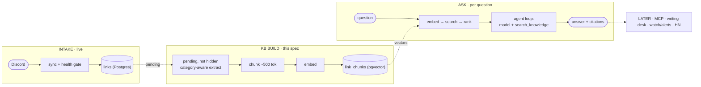

# Insights Agent — Spec

Turn the curated-links collection from a list of URLs into a knowledge base you can think with. Read the actual contents of every link, store them, make them searchable by meaning, and put an agent on top that answers questions using only that knowledge.

**Status:** the foundation (`links-registry-and-api.md`) is **shipped** — Postgres registry holds 500 links (9 provably dead never recorded), site/RSS/llms-full/homepage read the DB, public API at `/api/v1` with docs at `/api/docs`, admin hiding works, weekly health sweep runs, Discord is intake-only. This spec is what remains: extraction → embeddings → retrieval → the agent.

**Reviewed** by Cline (model: DeepSeek v4.1 flash high) — see [`../review/insights-agent-review.md`](../review/insights-agent-review.md). Plain-language walkthrough: [`../kb/`](../kb/README.md).

---

## The problems this solves (the actual pain)

**1. Writing is a scavenger hunt.** Every article I write starts the same way: blank page, 15 tabs of "things I remember reading," trying to reconstruct a framework from memory. The collection already contains the raw material for deep, well-referenced writing — essays on craft, agents, design, databases — but there's no way to surface "everything I've saved that's relevant to this paragraph." That's what the agent is for, for me and for anyone else writing in these domains.

**2. "Best tool for the job" is a judgment call the data can answer.** The Tools and Products channels hold hundreds of vetted options — sandboxes, compressors, agent infra, design utilities — with pricing and positioning on their pages. "I need a sandbox service for long-running agents, what's cheapest?" is answerable from the collection if we've actually read the pages. Keyword search on titles can't do it.

**3. You can't search for what you can't name.** "I've saved something about why rounded corners nest weirdly" — the article is literally called *Corners are relative*, and `corners` isn't in "nested rounded rectangles look wrong". Today's search matches substrings of titles and URLs, so forgotten = lost. Semantic search over the *contents* is the fix.

**Root cause of all three:** the collection stores *pointers* (URL + OG description), not *knowledge* (what the pages actually say). The fix is not a chatbot on the page — it's an extraction-and-retrieval pipeline with an agent on top.

---

## The core insight

Every link is a fragment — an idea that shifted a perspective, a tool that solved a problem. Individually small; together, an interconnected body of thinking. Right now that structure is invisible because we never read the pages. **The knowledge graph starts the moment we extract contents and embed them.** This spec is about building that layer once, simply, and letting every future feature (agent, MCP, HN, alerts) sit on it.

---

## Concepts I need before building (5-minute version)

- **Embedding** — a model turns text into a list of ~1536 numbers (a vector). Texts with similar meaning get similar vectors. This is "search by meaning" instead of search by substring. Cost: `text-embedding-3-small` at $0.02 per 1M tokens — the whole collection costs a few cents.
- **Chunk** — long articles get split into ~500-token pieces before embedding. Why: a 4,000-word essay averages out to a blurry vector; each chunk keeps one clear idea, and citations can point to the exact passage.
- **Vector search** — store all chunk vectors in Postgres (`pgvector`), then for a question: embed the question, ask for the nearest chunks mathematically. "Nearest" = most similar in meaning.
- **RAG (retrieval-augmented generation)** — instead of letting an LLM answer from its training (it has never seen my collection), we: retrieve the top-k relevant chunks → paste them into the prompt → the model answers *grounded* in them and cites real sources. Hallucination drops because the facts are in the prompt.
- **Tool / function calling** — you give the model a callable function (`search_knowledge("query")`). When it needs information, it emits a call; your code runs it and returns results; the model continues with them in view.
- **Agent** — just a loop: model → tool call → result → model… until it decides it can answer. Vercel AI SDK runs this loop for you (`generateText`/`streamText` with tools + `stopWhen`).

That's the whole vocabulary. Everything below is these six pieces arranged sanely.

---

## What the actual data looks like (checked, not assumed)

Read the live collection (measured at snapshot: 510 unique → **500 recorded**, 7 channels):

| Channel | What's actually there | Extraction strategy |
| :--- | :--- | :--- |
| Articles | Long-form essays — brandur, seangoedecke, lucumr, PG, independent blogs | **Full article text.** The crown jewels for writing assistance. |
| Resources | Courses, books, learning paths, docs (learn-inference, Butterick's) | Landing page + syllabus/TOC. Know *what it teaches*, don't crawl the whole course. |
| Tools | Libraries, CLIs, small apps (many GitHub repos) | Homepage + README + features/pricing section → structured facts. |
| Products | SaaS pages (boat, Subframe, Conductor) | Homepage + /pricing → what it does, what it costs, who it's for. |
| Portfolios, Design, Newsletters | Mostly visual or one-pagers | **Never fetched** — their title + description is indexed as one passage so they stay findable. Deep fetch = money for nothing. |

~360 of the 500 deserve real extraction (articles 100, resources 91, products 85, tools 84); the other 140 (portfolios, design, newsletters) are never fetched, only indexed by their description. Hidden links are neither extracted nor indexed. This split is also how the budget stays near zero.

Also found in the live data: several links are `Untitled` — weak metadata at intake, which extraction fixes for free (real `<title>` from the page).

---

## The data-loss problem — already fixed

`getMessagesFromChannel` fetched the latest 100 messages per channel, no pagination — Articles had already hit the cap and was dropping old links. **Fixed by the registry (shipped):** 500 rows snapshotted into Postgres, the sync task appends new arrivals through a health gate, and every surface reads the DB. Extraction below runs against `extract_status='pending' AND hidden_at IS NULL` rows.

---

## Architecture — three pipelines, all boring



Reliability rules, applied everywhere:

1. **Idempotent ingest.** `url_key` uniqueness already prevents duplicate links (live). Extraction adds `content_hash` so re-runs process only new/changed pages. Crash anywhere → rerun the script, nothing doubles.
2. **Extraction fallback ladder, never fatal.** Static fetch → Readability over jsdom (it needs a real DOM; `node-html-parser` won't do) → headless render (verify Chromium is reachable where extraction runs, not just in the link-preview route) → give up cleanly, mark `failed`, keep description-level data. One bad page can't block 500.
3. **The model can only cite what it received.** The UI renders only links returned by tool calls, so invented URLs are structurally impossible, not just prompt-discouraged.
4. **Honest degradation.** No good chunks → "the collection doesn't cover this" + nearest category. Vector DB down → plain message, page itself unaffected (agent is additive, never in the page's rendering path).
5. **The open web is untrusted.** The Compare tool's `fetch_link` fetches a URL the user supplies, so allow only http(s) and block private/internal addresses (SSRF guard). Fetched page text is treated as data, not instructions (prompt injection).

---

## Stack (total cost ≈ a coffee)

| Piece | Choice | Cost | Why |
| :--- | :--- | :--- | :--- |
| LLM + embeddings | OpenRouter for both — chat via `@openrouter/ai-sdk-provider`, embeddings via its `POST /api/v1/embeddings` (OpenAI-compatible) with `openai/text-embedding-3-small` | Embeddings: **~$0.05 one-time** (~450 pages × ~3K tokens). Chat: ~3.5K tokens/query ≈ **$0.001/query** | Credits already live on OpenRouter. One `OPENROUTER_API_KEY`, one `model.ts` boundary. 1536 dims matches the existing `vector(1536)` column — no schema change. Chat model pinned to `openai/gpt-4o-mini` in `model.ts` (tool-calling-capable). |
| Vector + text store | **Neon Postgres + pgvector** (existing DB) | $0 — free tier (0.5GB); 5K chunks ≈ 35MB | One service, plain SQL, Drizzle already in the repo. Changed from my earlier Upstash Vector pick: chunks are relational (chunk → link → channel), and one dependency beats two free ones. pgvector is also the standard thing worth learning. |
| Extraction | `fetch` + `@mozilla/readability` over **jsdom** (Readability needs a real DOM; `node-html-parser` won't do); fallback to headless Chromium for JS-heavy pages | $0 | No scraping SaaS. We already run headless Chromium for screenshots — reuse the pattern. If a Next route ever imports the extractor, list `jsdom` in `serverComponentsExternalPackages` (it's heavy). |
| Scheduling | Trigger.dev | $0 free tier | The sync task already detects + persists new links; extraction hooks in right after insert. |
| Auth-ish for public APIs | Upstash Redis ratelimits + visitor cookie pattern (already used by likes) | $0 | Public agent without accounts. |

**Budget reality:** runs on the existing OpenRouter balance. Rebuild the entire KB any time for ~5 cents. Chat at 1,000 queries/month ≈ $1. Everything else is on free tiers already in use.

---

## Data model

The tables (`links`, `link_chunks`) and every column's reasoning live in `links-registry-and-api.md` — single source of truth, not repeated here. This spec only adds what retrieval does with them.

Embedding text per chunk = chunk content. Retrieval joins back through `links` for title/URL/channel, excludes hidden and dead rows (same filter as `getLinks()`), and ranks by meaning alone. Two details worth pinning down: group the nearest chunks by link before ranking (the closest chunks can all be from one page), and don't rank by likes — the collection gets too few likes for that signal to mean anything.

**Chunking params (don't overthink):** ~500 tokens, ~15% overlap, split on paragraph boundaries. Citation unit = chunk → URL. The text that gets *embedded* is prefixed with `{title} — {channel}:` — a bare passage like "it also handles soft deletes well" is unfindable, the header makes it searchable. The stored `content` stays clean.

---

## The agent experiences (on top of the KB)

### 1. Ask — the public agent (solves problems 2 & 3)

Chat panel on the page. One tool: `search_knowledge(query, channel?)`. The loop: retrieve → maybe search again with a refined query → answer in a few sentences with real citations rendered as link cards (favicon, domain, title). The page keeps its existing like button; citations just don't show like counts.

Because retrieval is over **contents**, this does what the page never could:
- "something to test color contrast" → finds tools whose *pages* mention it
- "what have I saved about shipping vs building" → finds the seangoedecke essay
- "animated halftone shader effect" → finds the Maxime Heckel piece even if you forgot every proper noun in it

### 2. Writing Desk — the flagship (problem 1), mine first, public too

Same agent, different contract. Input: a thesis or draft paragraph. Output: the 6–10 most relevant fragments from the KB *with citations and a one-line "why this is relevant" each* — the 15-tabs moment, compressed into one query. Optional second step: propose an outline that weaves the fragments in.

I use it from my editor via curl/MCP later; anyone writing about design/engineering uses it on the site. The collection becomes a reusable context layer for thinking, not a museum of links.

**Status:** the retrieval core and an admin-only endpoint are built and working (`src/lib/kb/writing-desk.ts`, `POST /api/insights/desk`). What is deliberately *not* decided is where the writer types. That surface is a blog-publishing product — an editor needs commits, drafts, preview, publishing — and none of it makes retrieval better. It gets its own spec rather than holding this one hostage; until then the Desk is reachable by curl.

### 3. Compare & decide (problem 2, deeper)

"Compare sandbox services in the collection." Agent retrieves candidates, then can **fetch a page fresh** (`fetch_link` tool, 24h Redis cache, max 3 per question) when stored chunks aren't enough — e.g. a pricing detail. Returns a small table + a recommendation with tradeoffs. Choosing tools is a weekly pain; this is where the agent earns trust.

**Status: built.** `fetch_link` is a second tool on the same agent (`src/lib/kb/fetch-link.ts`), with the 24h cache and the 3-per-question cap, and the panel renders its pages as citations next to the searched passages — otherwise a comparison would cite nothing. It is also the **only SSRF surface in the project**: the URL comes from a model that has just read untrusted page text. Guarded on every hop; see `docs/kb/05-failure-modes.md` for the one gap that is known and accepted.

### Next, and last in this spec: MCP

- **MCP server** exposing `search_knowledge` → the collection inside Claude/Cursor mid-work. Reuses `search()` exactly as it stands: no schema change, no new data. It's also the honest test of the claim this whole spec rests on — that retrieval is *the layer* and everything else is a surface.

### Parked, and why

These were on this spec's roadmap. They are parked, not planned, because a feature has to be justified by a requirement that exists today. Each names the evidence that would bring it back.

- **Watch — intent subscriptions ("ping me when X lands") + a weekly written Pulse.** *Parked: it is circular today.* The intake is me posting links in Discord, so a standing intent would mostly ping me about links I just posted myself. It becomes meaningful only once rows arrive from somewhere that isn't me. The Pulse half has no such dependency, but there's no evidence anyone wants a weekly digest of three links either. **Revive when:** a foreign intake is writing rows, or someone asks for the digest.
- **Tend — three unrelated things, graded separately.**
  - *Dead-link repair* is the only part with a failure behind it: the weekly sweep marks links dead and they vanish from the page. But find-a-replacement → verify → update costs more code than the problem until we know the rate. **Revive when:** dead rows grow by more than a handful a quarter.
  - *Intent tags at ingest* (`free`, `open-source`, `motion`) needs a model call per link, a column, a backfill of 255 rows, and UI — and nothing consumes the tags yet. Tagging data nothing filters on is dead weight. **Revive when:** a filter is genuinely wanted ("just the free ones") and someone would use it.
  - *"Saved 4 months ago"* on the card is a one-liner and nearly pointless. Fold it in the next time a card is touched; it does not deserve a spec line.
- **HN as a second source.** The schema already accepts it (`source`, nullable `discord_id`, a globally unique `url_key`). The registry spec puts HN *ingestion* out of scope, and Watch is blocked on it. **Revive when:** Watch is, or the collection needs breadth it cannot get from curation.

Two of the three things originally written here as "Later" were imagined futures wearing a roadmap's clothes. Writing that down is cheaper than building them.

---

## How retrieval quality is proven (not vibes)

1. **Golden set** — `eval/kb-golden.json`, committed, written against the *live* collection: describe content, not titles ("fuzzy recall" cases especially).
2. **Retrieval check** — `scripts/kb-eval.ts` runs retrieval only (no LLM) and prints **recall@5** and **MRR@10**, measured per **link** since citations are links, next to a keyword baseline over title/description/url, plus unanswerable queries that must fall below a similarity cutoff. Gate: recall@5 ≥ 0.80 *and* beats the baseline.
3. Re-run after any ingest change (chunk size, extractor tweaks, extraction fixes). Watch the number move — that's the feedback loop that teaches RAG intuition.
4. **Extraction QA loop**: read the extracts by eye, fix the extractor, repeat. Weak extractor = weak KB, so this is the real product work.
5. Runtime honesty: agent answers must only contain tool-returned URLs; PostHog records every question (`insights_asked`) and every citation click (`insights_citation_clicked`), which is the signal that says whether answers are actually used.

**Extraction check: built.** `scripts/kb-fixtures.ts` froze 25 real pages into `eval/fixtures/`, and `kb-eval.ts` now reads each of them offline with the real reader — 25/25 at the moment. **Still not built:** the automated answer-grounding check (check 3 in `docs/kb/04-evals.md`).

---

## Deviations as built

Where the build disagreed with this spec, or the spec was silent and I chose. Brief on purpose — the reasoning is the point.

- **Extractor — three refinements.** The ladder worked, but the bulk run had pages marked `failed` that render fine one at a time. One Chromium per *run* instead of per page; a hard 25s cap per page, because a single URL hung a whole run; and a fall back to `document.body.innerText` when Readability finds under 50 words — it throws away the text on app-style pages. In `docs/kb/02-extraction.md`.
- **Description-only channels are indexed.** The spec's "description-level only" governed *fetching*, was silent on *indexing*, and the build read it as "don't index". That left 138 links (portfolios, design, newsletters) invisible to the agent. Now title + description is stored as one passage. No fetch added.
- **Chunks embed with a title/channel header.** The spec said "embedding text = chunk content". A bare passage like "it also handles soft deletes well" is unfindable without the title beside it.
- **`--status` flag on kb-extract.** The spec had no way to re-read rows that came back weak. It was needed the moment the extractor improved.
- **Eval scale.** The spec said ~40 answerable queries; there are 12. Written by hand against the real collection, so it is honest but small — a smoke test, not a benchmark.
- **Suggestion chips exist at all.** Not in the spec. They started hand-written, drifted into title-echoes ("Scale your Next.js app"), and are now derived from the collection 6-per-channel and verified against the index by `scripts/kb-suggestions.ts`.
- **`fetch_link` reads plain HTML only.** The spec asked for a tool that reads a page fresh; it did not say what to do when the page needs JavaScript. Putting the headless renderer in a request path would mean carrying Chromium in a serverless function for a rare case, so the tool answers "that page needs JavaScript" instead. The stored passages already cover those pages.
- **`kb-refresh` rotates; it does not filter by date.** The spec said "a weekly re-read of the most recently added links". Measured against the real table, a 90-day window covered 79 of 500 links — 84% of the collection would never have been re-read, and `content_hash` would have been consulted only for the newest slice. The job now reads least-recently-read first and caps at 100 per run (353 links are eligible), so everything is re-read roughly monthly and nothing is frozen. The cap bounds the cost; the date filter only added blind spots.
- **The Desk's similarity floor is 0.45, not the eval's 0.35.** Different questions: the eval asks "is this in the collection at all", the Desk asks "does this passage back this claim". Measured on two drafts — one the collection cannot support, one it can — noise sat at 0.35–0.44 and genuine support at 0.53 and 0.63. At 0.35 the model dutifully wrote three confident reasons to cite unrelated pages; at 0.45 that draft returns an empty list, which is the honest answer. The cost is real and accepted: a genuine secondary support around 0.4x is now missed. Precision wins because a wrong attribution gets published.
- **Writing Desk is a retrieval core, not an editor.** The spec bundled "where I write" together with "what backs this claim". They are different products, and only the second one needs a knowledge base. The core shipped; the editor became its own spec.

---

## Files

**Built**

```
src/lib/kb/
  model.ts        // the one file that names the models
  extract.ts      // the fallback ladder (see docs/kb/02-extraction.md)
  render.ts       // shared Chromium + a hard 25s cap per page
  ingest.ts       // read → chunk → embed → store; the script and the refresh share it
  chunk.ts        // ~500 tok, 15% overlap, paragraph-aware
  embed.ts        // OpenRouter /embeddings, batched 100, retries with backoff
  search.ts       // vector search → group by link → rank by similarity
  prompt.ts       // system prompt + citation rules
  agent.ts        // streamText + one tool, capped at 4 steps
  suggestions.ts  // reads the derived chips
  writing-desk.ts // draft → claims → the fragments that back them

src/app/api/insights/chat/route.ts     // the Ask endpoint (8/min, 60/day per IP)
src/app/api/insights/desk/route.ts     // Writing Desk, admin-only for now
src/app/api/v1/search/route.ts         // public semantic search — zod + OpenAPI
src/app/curated-links/components/AskPanel.tsx
src/content/insights-suggestions.json  // generated chips, 6 per channel

src/trigger/discord-links.ts  // intake (DONE)
src/trigger/kb-refresh.ts     // weekly re-read; least-recently-read first, capped at 100

scripts/snapshot-links.ts   // Discord → links registry (DONE)
scripts/kb-extract.ts       // extract → chunk → embed; --status re-reads weak rows
scripts/kb-report.ts        // writes docs/kb/build-report.md
scripts/kb-eval.ts          // the retrieval scoreboard
scripts/kb-suggestions.ts   // derive the chips, then verify them against the index
scripts/kb-fixtures.ts      // build the extraction fixtures from real pages
eval/kb-golden.json         // the test queries
eval/kb-fixtures.json       // saved pages + what the reader must find in each
```

**Still to do here: MCP (step 8).** Everything else is either parked with a stated reason — see
"Parked, and why" — or belongs to another spec: the browser editor is a publishing product, and HN
ingestion is out of scope in `links-registry-and-api.md`.

Tables exist (`drizzle/0008` pgvector, `0009` links + link_chunks). No migration has been needed since.

---

## Build order

0. ~~Snapshot.~~ **Done** (registry spec): 510 unique → 500 recorded, 9 dead skipped; site + API read the DB.
1. ~~**Extraction loop.**~~ **Done** — eyeballing tuned into measuring: `kb-extract --status`, `kb-report`, and the retrievability number in the report.
2. ~~**Chunk + embed + search.**~~ **Done** — `scripts/kb-eval.ts` is the "works without the UI" step.
3. ~~**Golden eval.**~~ **Done** — 12 answerable + 4 unanswerable queries. See the eval section for what is still missing.
4. ~~**Ask agent.**~~ **Done** — chat route, AskPanel, citations, rate limits, PostHog events on questions and citation clicks.
5. ~~**Writing Desk retrieval.**~~ **Done** — split the draft into claims, search once per claim, drop matches under a similarity floor, then let the model label only links it was handed. The *editor* is its own spec: decide it after using the Desk by curl on one real article.
6. ~~**Weekly refresh.**~~ **Done** — `src/trigger/kb-refresh.ts`, rotating and capped.
7. ~~**Compare/fetch tool.**~~ **Done** — `fetch_link`, SSRF-guarded, 24h cache, 3 per question.
8. **MCP server.** The last step here. Exposes `search_knowledge`; needs no new data.

Each step is independently shippable and verifiable. No step requires heroic faith.

---

## Risks, named

- **JS-heavy / bot-walled pages** (some articles, Twitter links): chromium fallback; failures stay description-level and marked. Accept partial coverage — 85% of a curated collection still beats 100% of nothing.
- **Paywalled/long-chapter resources**: extract syllabus, not content; honest `thin` status.
- **Stale content**: pages change; `content_hash` + a weekly rotating re-read (least-recently-read first, 100 links per run) keeps the KB fresh without a full re-crawl.
- **Scope creep into a graph database**: don't. Chunks + tags cover the use cases; entity/linkage graphs are a phase-2 garnish *if* the eval set ever demands them.

## Out of scope

- Accounts, chat history, saved sessions.
- Crawling beyond the 7 channels' linked pages. One exception, declared up front: reading a single same-domain page the strategy table already names (`/pricing`, a GitHub README) is allowed; anything past that is a spider, and out. The graph grows by curation.
- Agent writes anywhere except its own tables. Discord stays the intake; humans delete; the agent only adds.
