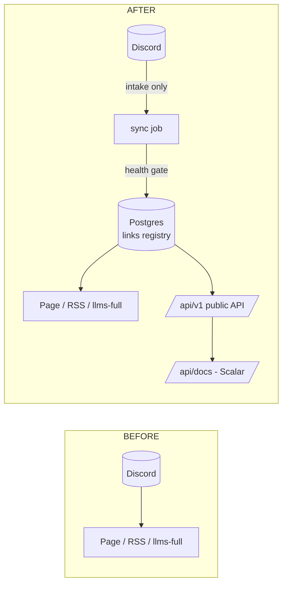

# Links Registry & Public API — Spec

Step 0 of the insights knowledge base (`insights-agent.md`).

Today Discord is both intake **and** database: the page reads the latest 100 messages **per channel** and anything older silently disappears. This is not hypothetical — measured against the live feed (Feb 2026): Articles is at **100/100** (old articles are falling off *now*), Products 98, Resources 96. The total on the page (~510) is what *survives*, not what exists. (RSS intentionally caps at `MAX_ITEMS = 60` — latest-only is correct for a feed.) This task: copy the collection into Postgres once, make Postgres the only thing the site reads, and expose it through a documented public API.



---

## 1. Tables

Two tables (`drizzle-kit generate` → `migrate`, one migration). Nothing else.

### `links` — one row per URL, at the moment it entered the collection

Discord is intake, not storage. Everything Discord can't hold — identity after dedupe, health, extraction state, admin judgment — needs a home that never forgets. This is it.

| Column | Type | Why it exists / why this type |
| :--- | :--- | :--- |
| `id` | `bigint generated always as identity` pk | Internal join target for chunks; never leaves the DB (public ids are `url_key`). IDENTITY over `serial` (explicit sequence ownership); `bigint` = never think about capacity, even with HN volumes later. |
| `source` | `text not null default 'discord'` | Where the link was captured: `discord` today, `hn` later. Cheaper than repurposing `channel` with fake values when the second source lands. Not a CHECK: sources evolve. |
| `discord_id` | `bigint unique`, nullable | The snowflake: provenance, chronological sort seed, **and the Redis like key** (`insights:likes`) — page keeps using it, likes survive the cutover untouched. `bigint` not text: snowflakes are u64 — sortable, half the storage. Nullable: HN rows have none. Unique: a repost refreshes it, never duplicates. |
| `url_key` | `text not null unique` | `normalizeUrl(url)` — the dedupe contract, shared byte-for-byte with the UI util. UNIQUE lets the database enforce what the app intends: two share-links to one article = one row, and a double post fails loudly instead of silently duplicating. |
| `url` | `text not null check (url <> '')` | The *final* URL after redirect-following at intake. Stored post-resolution so feed readers, citations, and the health checker all talk about the same address. CHECK bars junk rows. |
| `title` / `description` | `text not null default ''` | OG/embed values from Discord. Defaults: embeds regularly omit them; `''` keeps list rendering null-free. Extraction (KB step 1) may upgrade `title` — hence separate from the immutable provenance columns. |
| `channel` | `text not null` | Discord channel name; drives page tabs + API `?channel=`. **Deliberately no CHECK/enum**: channels evolve with the server; a constraint means an ALTER per new channel, a lookup table is ceremony for 7 values. App-side validation (`CHANNEL_LABELS`) is enough. |
| `added_at` | `timestamptz not null` | When the link entered the *collection* (decoded from snowflake / source timestamp), not when the row was created — backfills set it to original post time, so the timeline survives migration. |
| `hidden_at` | `timestamptz`, nullable | Admin hide (sec. 6). Timestamp over boolean: you get "when did I hide this" for free. |
| `health` | `text not null default 'unknown'` + CHECK | Machine-observed reachability: `unknown\|alive\|dying\|dead\|uncheckable`. Here a CHECK *is* right — the set is closed and stable (unlike `channel`); the DB rejecting `'alvie'` is a feature. Contrast with `channel`, one column over: constraint choice is per-field volatility, not religion. |
| `http_status` | `smallint` | Last observed code, for debugging `dying`/`dead` verdicts. Codes are 100–599 → smallest fitting int. |
| `consecutive_failures` | `smallint not null default 0` | State for the 3-strikes rule (sec. 2). A counter on the row replaces a health-log table. |
| `last_ok_at` | `timestamptz` | Anchors "failures ≥ 72h apart" and flapping detection. |
| `health_checked_at` | `timestamptz` | Lets the weekly job process stalest rows first. |
| `extract_status` | `text not null default 'pending'` + CHECK | The KB work queue: `pending\|ok\|thin\|failed\|skipped`. Extraction is just `WHERE extract_status='pending'`. `skipped` = intentionally description-only (portfolios); distinct from `failed` so re-run policies differ. |
| `raw_text` | `text`, nullable | Cleaned full page text — the KB's source material. Postgres TOASTs it off-row; list queries must never `SELECT *` (fetch per link only). |
| `content_hash` | `text` (sha256 hex) | Change detection for re-extraction. Hex-text over `bytea`: readable in psql; 64 chars costs nothing. |
| `extracted_at` | `timestamptz` | Staleness ordering for re-extraction sweeps. |
| `created_at` / `updated_at` | `timestamptz not null default now()` | Row bookkeeping. `updated_at` set by the app; a trigger is machinery this scale doesn't need. |

### `link_chunks` — citable passages + their vectors (KB step 1 fills)

| Column | Type | Why |
| :--- | :--- | :--- |
| `id` | `bigint generated always as identity` pk | Same reasoning as `links`. |
| `link_id` | `bigint not null references links(id) on delete cascade` | Chunks are meaningless without their parent → CASCADE (per FK guidance). |
| `chunk_index` | `smallint not null` | Order within the link. With `unique (link_id, chunk_index)`, a re-run re-embedding a link upserts instead of duplicating — **idempotency enforced by the DB, not by hope**. |
| `content` | `text not null` | The ~500-token citable passage. |
| `token_count` | `smallint not null` | Lets the agent budget prompt context without re-tokenizing at query time. |
| `embedding` | `vector(1536) not null` | Bound to `text-embedding-3-small` dims. **Model switch → column rebuild.** Full float precision; `halfvec` would halve storage but ~5k rows ≈ 35MB — optimizing now would be theater. |

### Indexes — each one earns its place, with the reason it exists

| Index | Serves | Why this and not more |
| :--- | :--- | :--- |
| pk on `links.id`, unique on `url_key`, unique on `discord_id` | joins, dedupe, repost-refresh | Constraints that double as indexes; free. |
| `(channel, added_at desc, id desc)` | The hot query: page's per-channel newest-first listing + API cursor pagination | Composite ordering: equality column first (`channel`), then the sort pair. The *unfiltered* newest-first listing stays a seq scan + sort on purpose — at < 10k rows that beats index maintenance (index-selection rule: if > 10–20% of the table matches, the index pays nothing). Add the partial `WHERE hidden_at is null` variant only when rows justify it. |
| `link_chunks (link_id)` | joins + cascade deletes | **Postgres does not index FK columns** — without this, deleting a link seq-scans the whole child table. |
| unique `(link_id, chunk_index)` | idempotent re-runs | Above. |
| HNSW on `embedding`, cosine | semantic retrieval | Exact kNN would already fly at 5k rows; HNSW is one line, cheap at this size, and keeps the serving path identical when the corpus grows. |

What was deliberately **not** added (the over-engineering list): updated_at trigger, health-check history table, channel lookup table, partial visible-only indexes, partitioning, halfvec. Each has a named trigger condition; none is met at ~700 rows.

### Who reads what (columns ↔ use cases)

| Consumer | Columns used | Never touches |
| :--- | :--- | :--- |
| Page / RSS / llms-full / homepage | `url_key, discord_id, url, title, description, channel, added_at` (filter: `hidden_at is null`, `health <> 'dead'`) | `raw_text`, health internals |
| Public API | same as page | `raw_text`, counters |
| Health job (weekly) | `url, health*, http_status, consecutive_failures, last_ok_at` | everything else |
| KB ingest | `extract_status, raw_text, content_hash, extracted_at` | health |
| Agent retrieval | `link_chunks.*` → join `links` for `url, title, channel` | page-serving fields except citation set |

## 2. Dead links: certainty is a ladder, not a detector

One HEAD request cannot convict a URL. Truth table:

| Signal | Verdict |
| :--- | :--- |
| DNS NXDOMAIN, connection refused | **dead** — gone for everyone |
| HTTP 404, 410 | **dead** |
| 301/308 → live URL | follow; record final URL, `alive` |
| 403 / 429 (Cloudflare, X/Twitter, LinkedIn) | **uncheckable** — bot wall, keep as-is |
| 500 / 502 / 503 / timeout | retry later; only `dead` after 3 consecutive failures ≥ 72h apart (`dying` until then) |
| 200 OK | `alive` |

Rules:

- **Snapshot:** check *before* insert. Conclusively dead → never recorded (per requirement). Ambiguous → recorded with its flag.
- **Checker mechanics:** HEAD first; a 405/501 or missing headers → GET with `Range: bytes=0-1024`. Browser User-Agent (datacenter UAs get walled). Concurrency 10, 10s timeout, follow ≤5 redirects.
- **Steady state:** weekly Trigger.dev job rechecks everything; `dying → dead` only via the 3-strikes rule. Dead links are excluded from page/API/RSS by query filter, not deleted.

Expected reality from the live collection: the handful of X/Twitter links land in `uncheckable` immediately. Accept it.

## 3. Page cutover

One query module, every consumer:

```
src/lib/links/queries.ts     // getLinks({ channel? }) — excludes hidden + dead
```

Switched to read it (same `unstable_cache` + tag pattern as today):

- `curated-links/page.tsx` (`getDiscordData` → `getLinks`)
- `curated-links/rss.xml`
- `llms-full.txt`
- `api/curated-links/latest` (homepage section)

`getDiscordData` stays only in the sync task. `CHANNEL_LABELS` unchanged.

Cutover verification before deleting anything:

1. Record count per channel ≈ what the page shows today (minus skipped dead).
2. Likes still render and increment (ids unchanged = snowflakes).
3. RSS items identical except missing dead links.

## 4. Intake: Discord becomes write-only

Existing `check-discord-links` Trigger.dev task changes: for each new message → normalize → health gate → insert into `links` → `revalidateTag`. Same dead-link rules as the snapshot. Duplicate (`url_key` conflict) → touch `discord_id`/`added_at` if the repost is newer.

## 5. Public API

Read-only v0. Next.js route handlers — deliberately **not** Fastify: three read endpoints don't justify a second service. The docs problem is solved without one (below).

```
GET /api/v1/links?channel=tools&limit=100&cursor=eyJhZGRlZF9hdCI6Li4ufQ
    → { data: [{ id, like_key, url, title, description, channel, added_at }], meta: { next_cursor } }

GET /api/v1/links/:id      → single item; :id is the url_key (human-readable)

Item shape: `id` = `url_key` (stable across sources, inspectable);
`like_key` = `discord_id` as string (nullable) — the Redis like key the live
site already uses, so existing likes keep working with zero migration.
GET /api/v1/channels       → [{ channel, count }]
```

- **Same data, same source:** handlers call `getLinks()` — API can never drift from the site. `getLinks()` excludes both machine-dead and admin-hidden links.
- **No auth in v0.** Data is public; Upstash IP ratelimit (60/min) + `X-RateLimit-*` headers. Keys arrive if write endpoints ever do.
- **CORS `*`**, GETs cacheable (`s-maxage=300`).
- **Cursor pagination** on `(added_at, id)` — offset pagination lies on a table that grows.
- **Errors:** `{ error: { code, message } }`, correct status codes. No leaking stack traces.

### Docs without doc drift

zod schemas in `src/lib/links/api-schemas.ts` validate requests **and** generate the spec:

- `@asteasolutions/zod-to-openapi` emits `openapi.json` from those schemas, served at `/api/v1/openapi.json`.
- `@scalar/nextjs-api-reference` renders it at `/api/docs`. (Scalar = the UI they asked about; Swagger UI does the same job, Scalar looks less like 2015.)
- Docs can never lie: they're built from the validation code that runs.

Update `llms.txt` to advertise `/api/v1` + `/api/docs` — it's the file agents actually read.

## 6. Admin: hiding links directly from the page

Some links age badly, and deleting them should happen where I'm already looking — the page itself.

- **Hide, don't delete.** `hidden_at` on `links`; setting it removes the link from every surface. Reversible, consistent with the no-hard-deletes rule.
- **Auth:** one server-side env, `ADMIN_SECRET` (already in `.env`). Admin endpoints require it as a Bearer token. Nothing `NEXT_PUBLIC_` — the key never ships in a bundle; the page stores it in `localStorage` after I type it once. Single-user site: sufficient. If it leaks, rotate the env var; done.
- **API (admin-tagged in the same OpenAPI spec):**
  - `DELETE /api/v1/links/:id` → set `hidden_at`, return 204
  - `POST /api/v1/links/:id/restore` → clear it
- **UI (minimal):** append `?admin` to the page → key prompt once → rows/cards grow a trash button with a confirm; success = the row is simply gone. No separate dashboard, no admin framework. Visitors see nothing.
- No restore UI in v0: `curl -X POST .../restore` covers mistakes.

## 7. Build order

0. Migration: `links` + `link_chunks` (chunks empty until KB step 1).
1. Snapshot script `scripts/snapshot-links.ts`: Discord → dedupe → health gate → insert. Run, log: inserted / skipped-dead / uncheckable counts.
2. Cutover surfaces to `getLinks()`; verify §3 checks.
3. Switch the Trigger.dev task to DB-append.
4. API handlers (public + admin hide/restore) + `?admin` trash UI + zod schemas + openapi + Scalar docs + `llms.txt` update.
5. KB spec step 1 (extraction) proceeds against `links` rows with `extract_status='pending'`.

Each step deploys alone; the site never breaks between them.

## 8. Out of scope

- Extraction/chunking/embeddings — that's `insights-agent.md` (these tables are designed for it; nothing here blocks it).
- Public-api auth/keys, write endpoints beyond admin hide, `POST /api/v1/search` (lands with the KB chat work).
- HN as a source — the `channel` column is where it slots in later, no schema change needed.
