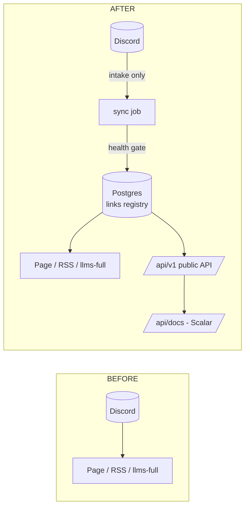

# Links Registry & Public API — Spec

Step 0 of the insights knowledge base (`insights-agent.md`).

Today Discord is both intake **and** database: the page, RSS and `llms-full.txt` all read the latest-100-messages window per channel, older links fall off. This task: copy the collection into Postgres once, make Postgres the only thing the site reads, and expose it through a documented public API.



---

## 1. Tables

Two tables, created in one drizzle migration (`drizzle-kit generate` → `migrate`). Nothing else.

```sql
create extension if not exists vector;

create table links (
  id                 serial primary key,

  -- identity
  url_key            text not null unique,   -- normalizeUrl(url): dedupe key
  url                text not null,          -- final URL after redirects
  title              text not null default '',
  description        text not null default '',
  channel            text not null,          -- reading-list | tools | ...
  discord_id         text not null unique,   -- snowflake; ALSO the Redis like key
  added_at           timestamptz not null,   -- decoded from snowflake

  -- health
  health             text not null default 'unknown',
                     -- unknown | alive | dying | dead | uncheckable
  http_status        integer,                -- last observed code
  consecutive_failures integer not null default 0,
  last_ok_at         timestamptz,
  health_checked_at  timestamptz,

  -- extraction (KB step 1 fills these)
  extract_status     text not null default 'pending',
                     -- pending | ok | thin | failed | skipped
  raw_text           text,
  content_hash       text,                   -- skip re-extract when unchanged
  extracted_at       timestamptz,

  created_at  timestamptz not null default now(),
  updated_at  timestamptz not null default now()
);

create table link_chunks (
  id          serial primary key,
  link_id     integer not null references links(id) on delete cascade,
  chunk_index integer not null,
  content     text not null,
  embedding   vector(1536)
);
create index on link_chunks using hnsw (embedding vector_cosine_ops);
```

Decisions:

- **`discord_id` survives the cutover.** Likes live in Redis keyed by snowflake (`insights:likes`). The page and API keep emitting `discord_id` as item `id`, so existing likes keep working with zero migration.
- **`url` is the final URL** after following permanent redirects at intake. `url_key` is computed from it, so "same article, two share links" dedupes correctly.
- **Health history = counters on the row**, not a log table. Three fields answer "how sure are we it's dead" without a second table.
- **No hard deletes, ever.** Dead links get `health='dead'` and filters exclude them. History stays.

## 2. Dead links: certainty is a ladder, not a detector

One HEAD request cannot convict a URL. Truth table:

| Signal | Verdict |
| :--- | :--- |
| DNS NXDOMAIN, connection refused | **dead** — gone for everyone |
| HTTP 404, 410 | **dead** |
| 301/308 → live URL | follow; record final URL, `alive` |
| 403 / 429 (Cloudflare, X/Twitter, LinkedIn) | **uncheckable** — bot wall, keep as-is |
| 500 / 502 / 503 / timeout | retry later; only `dead` after 3 consecutive failures ≥ 72h apart (`dying` until then) |
| 200 OK | `alive` |

Rules:

- **Snapshot:** check *before* insert. Conclusively dead → never recorded (per requirement). Ambiguous → recorded with its flag.
- **Checker mechanics:** HEAD first; a 405/501 or missing headers → GET with `Range: bytes=0-1024`. Browser User-Agent (datacenter UAs get walled). Concurrency 10, 10s timeout, follow ≤5 redirects.
- **Steady state:** weekly Trigger.dev job rechecks everything; `dying → dead` only via the 3-strikes rule. Dead links are excluded from page/API/RSS by query filter, not deleted.

Expected reality from the live collection: the handful of X/Twitter links land in `uncheckable` immediately. Accept it.

## 3. Page cutover

One query module, every consumer:

```
src/lib/links/queries.ts     // getLinks({ channel?, excludeDead: true })
```

Switched to read it (same `unstable_cache` + tag pattern as today):

- `curated-links/page.tsx` (`getDiscordData` → `getLinks`)
- `curated-links/rss.xml`
- `llms-full.txt`
- `api/curated-links/latest` (homepage section)

`getDiscordData` stays only in the sync task. `CHANNEL_LABELS` unchanged.

Cutover verification before deleting anything:

1. Record count per channel ≈ what the page shows today (minus skipped dead).
2. Likes still render and increment (ids unchanged = snowflakes).
3. RSS items identical except missing dead links.

## 4. Intake: Discord becomes write-only

Existing `check-discord-links` Trigger.dev task changes: for each new message → normalize → health gate → insert into `links` → `revalidateTag`. Same dead-link rules as the snapshot. Duplicate (`url_key` conflict) → touch `discord_id`/`added_at` if the repost is newer.

## 5. Public API

Read-only v0. Next.js route handlers — deliberately **not** Fastify: three read endpoints don't justify a second service. The docs problem is solved without one (below).

```
GET /api/v1/links?channel=tools&limit=100&cursor=eyJpZCI6MTIzfQ
    → { data: [{ id, url, title, description, channel, added_at }], meta: { next_cursor } }

GET /api/v1/links/:id      → single item, 404 for dead/unknown ids
GET /api/v1/channels       → [{ channel, count }]
```

- **Same data, same source:** handlers call `getLinks()` — API can never drift from the site.
- **No auth in v0.** Data is public; Upstash IP ratelimit (60/min) + `X-RateLimit-*` headers. Keys arrive if write endpoints ever do.
- **CORS `*`**, GETs cacheable (`s-maxage=300`).
- **Cursor pagination** on `(added_at, id)` — offset pagination lies on a table that grows.
- **Errors:** `{ error: { code, message } }`, correct status codes. No leaking stack traces.

### Docs without doc drift

zod schemas in `src/lib/links/api-schemas.ts` validate requests **and** generate the spec:

- `@asteasolutions/zod-to-openapi` emits `openapi.json` from those schemas, served at `/api/v1/openapi.json`.
- `@scalar/nextjs-api-reference` renders it at `/api/docs`. (Scalar = the UI they asked about; Swagger UI does the same job, Scalar looks less like 2015.)
- Docs can never lie: they're built from the validation code that runs.

Update `llms.txt` to advertise `/api/v1` + `/api/docs` — it's the file agents actually read.

## 6. Build order

0. Migration: `links` + `link_chunks` (chunks empty until KB step 1).
1. Snapshot script `scripts/snapshot-links.ts`: Discord → dedupe → health gate → insert. Run, log: inserted / skipped-dead / uncheckable counts.
2. Cutover surfaces to `getLinks()`; verify §3 checks.
3. Switch the Trigger.dev task to DB-append.
4. API handlers + zod schemas + openapi + Scalar docs + `llms.txt` update.
5. KB spec step 1 (extraction) proceeds against `links` rows with `extract_status='pending'`.

Each step deploys alone; the site never breaks between them.

## 7. Out of scope

- Extraction/chunking/embeddings — that's `insights-agent.md` (these tables are designed for it; nothing here blocks it).
- API auth, api keys, write endpoints, `POST /api/v1/search` (lands with the KB chat work).
- HN as a source — the `channel` column is where it slots in later, no schema change needed.
