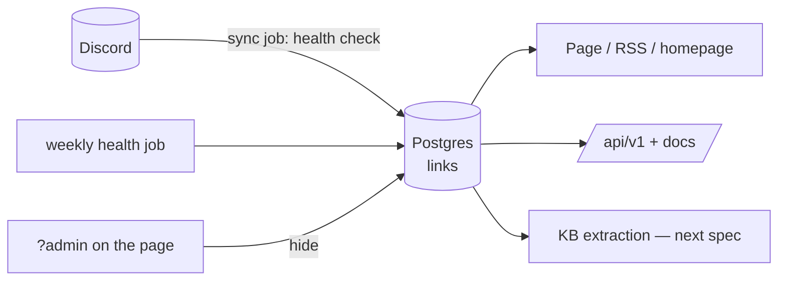

# Links Registry & Public API — Spec

Step 0 of the insights knowledge base (`insights-agent.md`). Read top to bottom; each section is one piece.

## Why this exists

The collection lives in Discord. Discord only serves the newest **100 messages per channel** — and Articles already sits at exactly 100/100. Every new article silently pushes the oldest one off the site. Products (98) and Resources (96) are next. The ~510 links on the page are what *survive*, not what exists.

So: copy the collection into our own Postgres table once, make the site read from Postgres forever after, and expose the same data through a small documented public API. Discord stays as the place where links are *added* — nothing more.

## The life of a link (the whole system as one story)



1. I post a link in `#tools`.
2. The sync job (already runs on Trigger.dev) notices it, checks the URL is alive, inserts one row into `links`. If the URL was posted before, the database rejects the duplicate and we update the existing row instead. If the URL is provably dead (404, domain gone), it never gets inserted.
3. The page, RSS, homepage section, and public API all read from `links`. Nobody reads Discord except the sync job.
4. A weekly job re-checks every URL. Three failed weeks in a row → marked `dead` → disappears everywhere. The row stays in the table; nothing is ever hard-deleted.
5. I spot a low-quality link while browsing → open the page with `?admin` → trash icon → the row gets a `hidden_at` stamp and disappears everywhere. Undoable.
6. (Next spec) the KB extraction picks up rows marked `pending`, reads the pages, and fills `link_chunks` with searchable passages.

Every section below is one of those steps in detail.

---

## The tables

Two tables, one drizzle migration (`drizzle-kit generate` → `migrate`).

### `links` — the registry

One row per URL, recorded when it entered the collection. Discord is intake, not storage; this table is the home that never forgets.

**Identity — what the link is and where it came from**

| Column | Type | Stores / why |
| :--- | :--- | :--- |
| `id` | `bigint generated always as identity`, pk | Internal join key, never leaves the DB (the public id is `url_key`). `bigint` so HN-scale volumes later are a non-event. |
| `source` | `text`, default `'discord'` | Which intake produced the row: `discord` today, `hn` later. See "Where HackerNews fits". |
| `discord_id` | `bigint`, unique, nullable | The Discord snowflake. Doubles as the like key in Redis — so existing likes survive the cutover with zero migration. Nullable because future non-Discord rows have none. `bigint` because snowflakes are 64-bit numbers, not strings. |
| `url_key` | `text`, unique, not null | `normalizeUrl(url)` — same function the UI uses. The unique constraint makes the database itself reject duplicates; dedupe stops being a promise and becomes a fact. |
| `url` | `text`, not null | The *final* URL after following redirects at intake. Page, health checker, and citations all speak of one address. |
| `title`, `description` | `text`, default `''` | From Discord embeds. Defaults because embeds often lack them; KB extraction may improve them later. |
| `channel` | `text`, not null | Discord channel name; drives the page tabs and `?channel=` filter. Deliberately no DB constraint — channels change more often than schemas should; validation lives in app code. |
| `added_at` | `timestamptz`, not null | When the link entered the *collection* (decoded from the snowflake), not when this row was created. Backfills keep true dates; the timeline survives migration. |

**Visibility & health — what the site should show**

| Column | Type | Stores / why |
| :--- | :--- | :--- |
| `hidden_at` | `timestamptz`, nullable | My delete button (see Admin section). Null = visible. A timestamp, not a boolean: "when did I hide this" comes free. |
| `health` | `text`, CHECK constraint | Machine-observed reachability: `unknown / alive / dying / dead / uncheckable`. The set is closed and stable, so the database rejects typos like `'alvie'`. (Contrast with `channel`: closed set → constrain; evolving set → don't.) |
| `consecutive_failures` | `smallint`, default 0 | The 3-strikes counter. One number replaces a whole health-history table. |
| `health_checked_at` | `timestamptz` | When this URL was last checked; the weekly job processes stalest rows first. |

**Extraction — ignored until the KB step fills them**

| Column | Type | Stores / why |
| :--- | :--- | :--- |
| `extract_status` | `text`, default `'pending'`, CHECK | The KB's work queue: `pending / ok / thin / failed / skipped`. Extraction is `WHERE extract_status = 'pending' AND hidden_at IS NULL` — hidden links never get embedded. `skipped` (portfolios etc. — never fetched, but still indexed by title + description) is distinct from `failed` so retry policies can differ. |
| `raw_text` | `text`, nullable | The cleaned page text. List queries never select it; fetched per link only. |
| `content_hash` | `text` | sha256 of the extracted text. Skip re-extracting pages that haven't changed. |
| `extracted_at` | `timestamptz` | When; drives staleness sweeps. |

Plus `created_at` / `updated_at` (`timestamptz`, default `now()`) — ordinary bookkeeping; `updated_at` is set by the app, no trigger.

*Removed in review:* `http_status` and `last_ok_at`. No query ever read them — debugging a verdict happens in the health job's run logs, and with a fixed weekly cadence the "failures must be spread over time" rule is guaranteed by the calendar, not a timestamp. Both are one instant `ADD COLUMN` away if a real need appears.

### `link_chunks` — searchable passages (filled by the KB step; created now to save a migration)

| Column | Type | Why |
| :--- | :--- | :--- |
| `id` | `bigint generated always as identity`, pk | Same as `links`. |
| `link_id` | `bigint → links(id) on delete cascade` | Chunks are meaningless without their parent, so deleting a link takes its chunks along. Indexed — Postgres never indexes FK columns on its own, and without it every parent delete would scan the whole child table. |
| `chunk_index` | `smallint` | Position within the link. Together with `unique (link_id, chunk_index)`: re-embedding a link *upserts* instead of duplicating. Idempotency enforced by the database, not by hope. |
| `content` | `text` | The ~500-token passage. This is the unit the agent cites. |
| `token_count` | `smallint` | Lets the agent budget prompt context without re-tokenizing at query time. |
| `embedding` | `vector(1536)` | The passage as a meaning-vector, produced by `text-embedding-3-small`. **Changing embedding models means rewriting this column.** Full float precision — at ~5k rows (~35MB) a compressed `halfvec` would be theater. |

**Indexes, and the reasoning for each:**

| Index | Serves | Why this one |
| :--- | :--- | :--- |
| primary keys, unique(`url_key`), unique(`discord_id`) | joins, dedupe, repost-refresh | Constraints that double as indexes; free. |
| `(channel, added_at desc, id desc)` | the hot query — page's per-channel newest-first listing, API cursor pages | Equality column first, then the sort pair (standard composite rule). The *unfiltered* newest-first listing stays a sequential scan on purpose: under ~10k rows that's cheaper than maintaining another index. Add a partial `WHERE hidden_at is null` index only when row counts ask for it. |
| `(link_id)` on `link_chunks` | joins, cascade deletes | See above. |
| unique `(link_id, chunk_index)` | idempotent re-runs | See above. |
| HNSW on `embedding`, cosine | semantic retrieval | Exact search would already be fast at 5k rows; the index is one line, cheap, and keeps the serving shape identical when the corpus grows. |

Nothing else. No trigger, no history table, no lookup table, no partitioning — each has a condition under which it returns; none is met at ~700 rows.

---

## Dead links: what "dead" even means

A single failed request proves nothing — sites have bad minutes, and many block bots while being perfectly alive for humans. So death is a ladder of certainty:

| Signal at check time | Verdict |
| :--- | :--- |
| Domain doesn't resolve (DNS NXDOMAIN), connection refused | **dead** — gone for everyone |
| HTTP 404 / 410 | **dead** — the site itself says it's gone |
| 301/308 redirect to a live URL | not dead — follow it, store the final URL |
| 403 / 429 (Cloudflare walls, X/Twitter) | **uncheckable** — alive for humans, hostile to bots; keep as-is |
| 500 / 502 / 503 / timeout | fail *this week*; only `dead` after **3 failed weeks in a row** (`dying` until then) |
| 200 OK | `alive` |

Rules:

- **Snapshot:** the check runs *before* insert. Provably dead → never recorded. Anything ambiguous → recorded with its flag.
- **Weekly job:** rechecks everything *visible* (hidden rows earn no checks — nobody sees them), updates `consecutive_failures`; `dead` links are excluded from page/API/RSS by query filter, never deleted.
- **Checker mechanics:** try HEAD first; if the server refuses HEAD, GET just the first KB. Use a real browser User-Agent (datacenter agents get walled). 10s timeout, follow ≤5 redirects, 10 URLs at a time.

---

## The public API

Read-only v0, served by Next.js route handlers. Not Fastify: a second service to deploy and secure buys nothing for three GET endpoints; the docs problem is solved without it (below).

```
GET /api/v1/links?channel=tools&limit=100&cursor=...
    → { data: [{ id, like_key, url, title, description, channel, added_at }],
        meta: { next_cursor } }

GET /api/v1/links?url=https://brandur.org/minimalism
    → exact lookup: one item or 404. Query param, not a path segment —
      url_keys contain slashes.
GET /api/v1/channels     → { data: [{ channel, count }] }
```

- `id` is the `url_key` — stable across sources and inspectable in a browser bar. `like_key` is the `discord_id` as a string (nullable) — the Redis like key the live site already uses.
- Same function serves site and API (`getLinks()` in `src/lib/links/queries.ts`) — the API can't drift from the page. Both exclude hidden and dead rows.
- Cursor pagination on `(added_at, id)` — offset pagination lies on a table that grows while you page.
- No auth in v0 (the data is public anyway); Upstash IP rate limit 60/min with `X-RateLimit-*` headers; CORS open; `s-maxage=300`.
- Errors: `{ error: { code, message } }` with correct status codes.

**Docs that can't drift:** request/response shapes are zod schemas (already in the repo) → `@asteasolutions/zod-to-openapi` generates `openapi.json` from the same code that validates requests → Scalar renders it at `/api/docs`. Update `llms.txt` to advertise both — that's the file agents actually read.

---

## Admin: hide links from the page itself

- One server-side env, `ADMIN_SECRET` (already in `.env`), sent as a Bearer token to admin endpoints. Nothing `NEXT_PUBLIC_` — the key never ships in a bundle; the page stores it in `localStorage` after I type it once. Single-user site: sufficient. Leak → rotate the var, done.
- `POST /api/v1/links/hide` `{ url }` sets `hidden_at`; `POST /api/v1/links/unhide` `{ url }` clears it. Body-based, same reason: url_keys can't ride path segments. Both documented in the same OpenAPI spec, tagged `admin`.
- UI: `?admin` in the page URL → key prompt once → rows grow a trash button with confirm → success removes the row. Visitors see nothing. No dashboard, no framework.
- No restore UI in v0: a one-off `POST /api/v1/links/unhide` covers mistakes.

---

## Where HackerNews fits later

Not built now. The schema just refuses to block it:

- HN becomes a second intake: a job pulls stories (Algolia HN API — `hnUtils.ts` already talks to it) and writes rows into the **same** `links` table with `source='hn'`, `discord_id = null`, and `channel` carrying the story type (`top` / `show` / `ask`).
- Because `url_key` is globally unique, an essay I saved in Discord that later hits HN stays **one row** — dedupe across sources for free.
- Health checks, KB extraction, and agent retrieval don't care where a row came from; `source` is just a filter.
- The design choices that buy this: `source` existing at all, `discord_id` nullable, public ids = `url_key` instead of anything Discord-shaped. Nothing more.

---

## Build order

0. Migration: `links` + `link_chunks` (chunks stay empty until the KB step).
1. `scripts/snapshot-links.ts`: Discord → dedupe → health gate → insert. Log inserted / skipped-dead / uncheckable counts.
2. Cut the surfaces (`curated-links` page, RSS, `llms-full.txt`, homepage) to `getLinks()`. Verify: per-channel counts match today minus skipped-dead; likes still work (keys unchanged); RSS differs only by removed dead links.
3. Switch the Trigger.dev sync task to append into `links` (same health gate).
4. Public API + admin endpoints + `?admin` trash UI + OpenAPI + Scalar docs + `llms.txt`.
5. Hand off to the KB spec: extraction runs against `extract_status='pending' AND hidden_at IS NULL` rows.

Each step deploys alone; the site never breaks between them.

## Out of scope

- Extraction, chunking, embeddings — `insights-agent.md`.
- HN ingestion itself.
- Public-API auth/keys, `POST /api/v1/search` (arrives with the KB agent), restore UI, partitioning or any scale machinery the row count doesn't justify.
